# Workflow Diagrams: Remote Devcontainer System

**Last Updated:** 2025-01-23
**Purpose:** Visual documentation of all workflows, protocols, and data flows
**Format:** Mermaid diagrams (renderable in GitHub, IDEs, and documentation systems)

> Update (2025-01-23): Mac private keys are no longer copied to the remote host or container. The devcontainer uses the remote host user (`rmanaloto`), stages only host `~/.ssh/*.pub` for `authorized_keys`, and relies on the host SSH agent (with port 443 fallback to ssh.github.com) for outbound GitHub SSH. Diagrams that show `~/devcontainers/ssh_keys` reflect the legacy flow.

Sources live in `docs/Diagrams/*.mmd`. Render to SVG/PNG with `./scripts/render_diagrams.sh --output docs/Diagrams/rendered` (run inside the devcontainer to use the baked mermaid-cli toolchain).

---

## Table of Contents

1. [Complete System Architecture](#1-complete-system-architecture)
2. [Deployment Sequence](#2-deployment-sequence)
3. [Build Process Flow](#3-build-process-flow)
4. [SSH Authentication Flows](#4-ssh-authentication-flows)
5. [Docker Networking](#5-docker-networking)
6. [File System Mounts](#6-file-system-mounts)
7. [Security Issues Visualization](#7-security-issues-visualization)
8. [Proposed Architecture](#8-proposed-architecture)

---

## 1. Complete System Architecture

### System Context Diagram


### Physical Topology

```mermaid
graph TB
    subgraph "Developer's Mac (Local)"
        A[Mac Terminal]
        B[~/.ssh/id_ed25519 🔑]
        C[~/dev/github/SlotMap 📁]
    end

    subgraph "Internet"
        I[GitHub.com]
        V[vcpkg Registry]
    end

    subgraph "Remote Host: c24s1.ch2"
        D[SSH Server :22]
        E[Docker Daemon]
        F[~/dev/github/SlotMap 📁]
        G[~/devcontainers/ssh_keys 🔑⚠️]

        subgraph "Docker Container"
            H[sshd :2222]
            J[~/.ssh bind mount ⚠️]
            K[~/workspace bind mount]
            L[clang-21, cmake, vcpkg]
        end
    end

    A -->|"SSH (port 22)"| D
    A -->|"rsync ~/.ssh/ ⚠️"| G
    A -->|"git push"| I
    D -->|"Docker port mapping<br/>9222→2222"| H
    E -->|"Manage"| H
    F -->|"Bind mount"| K
    G -->|"Bind mount ⚠️"| J
    J -->|"Git operations ⚠️"| I
    L -->|"Download"| V

    style B fill:#ff6b6b
    style G fill:#ff6b6b
    style J fill:#ff6b6b
```



---

## 2. Deployment Sequence

### Complete Deployment Flow

```mermaid
sequenceDiagram
    actor Dev as Developer (Mac)
    participant Local as Local Git
    participant Deploy as deploy_remote_devcontainer.sh
    participant Remote as Remote Host (c24s1)
    participant RemoteGit as Remote Git Repo
    participant RunScript as run_local_devcontainer.sh
    participant Docker as Docker/BuildKit
    participant Container as Devcontainer
    participant GitHub as GitHub.com

    Note over Dev,Container: Phase 1: Local Preparation

    Dev->>Local: git status
    Local-->>Dev: Working tree clean

    Dev->>Deploy: ./scripts/deploy_remote_devcontainer.sh
    Deploy->>Local: git push origin <branch>
    Local->>GitHub: Push commits

    Note over Deploy,Remote: ⚠️ SECURITY ISSUE: Sync private keys
    Deploy->>Remote: rsync ~/.ssh/ → ~/devcontainers/ssh_keys/
    Remote-->>Deploy: Private key copied ⚠️

    Deploy->>Remote: SSH: Trigger run_local_devcontainer.sh

    Note over Remote,Container: Phase 2: Remote Build

    Remote->>RemoteGit: git pull origin <branch>
    RemoteGit->>GitHub: Fetch latest

    Remote->>RunScript: Execute build script
    RunScript->>RunScript: rm -rf ~/dev/devcontainers/cpp-devcontainer
    RunScript->>RunScript: rsync repo → sandbox
    RunScript->>RunScript: Copy .pub keys to .devcontainer/ssh/

    Note over RunScript,Docker: Build Base Image (if needed)
    RunScript->>Docker: docker buildx bake base
    Docker->>Docker: Build Ubuntu 24.04 + tools
    Docker-->>RunScript: cpp-dev-base:local ready

    Note over RunScript,Docker: Build Tool Stages (Parallel)
    RunScript->>Docker: docker buildx bake tools

    par Parallel Tool Builds
        Docker->>Docker: clang_p2996 (30 min)
        Docker->>Docker: node_mermaid (5 min)
        Docker->>Docker: mold (1 min)
        Docker->>Docker: gh_cli (1 min)
        Docker->>Docker: ccache (1 min)
        Docker->>Docker: sccache (1 min)
        Docker->>Docker: ripgrep (1 min)
        Docker->>Docker: cppcheck (10 min)
        Docker->>Docker: valgrind (15 min)
        Docker->>Docker: python_tools (2 min)
        Docker->>Docker: pixi (1 min)
        Docker->>Docker: iwyu (20 min)
        Docker->>Docker: mrdocs (1 min)
        Docker->>Docker: jq (1 min)
        Docker->>Docker: awscli (2 min)
    end

    Docker-->>RunScript: All tools built

    RunScript->>Docker: docker buildx bake devcontainer
    Docker->>Docker: Merge all tool stages
    Docker-->>RunScript: cpp-devcontainer:local ready

    Note over RunScript,Container: Start Container
    RunScript->>Docker: devcontainer up --workspace-folder ...
    Docker->>Container: Create container
    Docker->>Container: Bind mount workspace
    Docker->>Container: Bind mount ssh_keys ⚠️
    Docker->>Container: Port map 9222:2222
    Container->>Container: Run post-create script
    Container->>Container: Start sshd on :2222
    Container-->>RunScript: Container ready

    RunScript-->>Deploy: Build complete

    Note over Dev,Container: Phase 3: Connectivity Test
    Deploy->>Container: ssh -p 9222 test connection
    Container-->>Deploy: SSH_OK

    Deploy->>Container: Validate environment
    Container->>Container: Check tools (clang, cmake, etc.)
    Container->>GitHub: ssh -i ~/.ssh/id_ed25519 -T git@github.com ⚠️
    GitHub-->>Container: Authenticated
    Container-->>Deploy: All tests passed

    Deploy-->>Dev: Deployment complete
```



### State Machine: Container Lifecycle


---

## 3. Build Process Flow

### Docker Bake Dependency Graph


### Build Timeline (First Build)


---

## 4. SSH Authentication Flows

### Flow 1: Mac → Remote Host (Initial Connection)


### Flow 2: Mac → Container (via Port Mapping)


### Flow 3: Container → GitHub (Current Implementation ⚠️)

```mermaid
sequenceDiagram
    participant Container as Container Process<br/>(git push)
    participant BindMount as ~/.ssh/id_ed25519<br/>(bind-mounted ⚠️)
    participant ContainerSSH as Container SSH Client
    participant GitHub as GitHub SSH Server<br/>(git@github.com)
    participant GitHubKeys as GitHub User Keys

    Note over Container,GitHub: Outbound Connection
    Container->>ContainerSSH: Execute: git push
    ContainerSSH->>GitHub: TCP SYN (port 22)
    GitHub-->>ContainerSSH: TCP SYN-ACK

    Note over Container,GitHub: SSH Protocol
    GitHub->>ContainerSSH: SSH-2.0 banner
    ContainerSSH->>GitHub: Algorithm negotiation
    ContainerSSH->>GitHub: DH key exchange
    GitHub->>ContainerSSH: GitHub host key
    ContainerSSH->>ContainerSSH: Verify known_hosts

    Note over Container,GitHub: ⚠️ SECURITY ISSUE: Uses private key
    GitHub->>ContainerSSH: Request publickey
    ContainerSSH->>BindMount: Read private key ⚠️
    BindMount-->>ContainerSSH: Private key data
    ContainerSSH->>ContainerSSH: Sign challenge
    ContainerSSH->>GitHub: Send signature

    GitHub->>GitHubKeys: Lookup public key for user
    GitHubKeys-->>GitHub: Found matching key
    GitHub->>GitHub: Verify signature
    GitHub-->>ContainerSSH: Authentication success

    Note over Container,GitHub: Git Protocol
    ContainerSSH->>GitHub: Git pack protocol
    GitHub-->>ContainerSSH: Receive objects
    Container-->>Container: Push complete

    rect rgb(255, 200, 200)
        Note over BindMount: Private key exposed on<br/>remote filesystem:<br/>/home/rmanaloto/devcontainers/ssh_keys/id_ed25519
    end
```



### Flow 4: Container → GitHub (Proposed: SSH Agent Forwarding)

```mermaid
sequenceDiagram
    participant Mac as Mac (SSH Agent)
    participant MacAgent as ssh-agent<br/>SSH_AUTH_SOCK
    participant SSHTunnel as SSH Connection<br/>(Mac → Container)
    participant Container as Container Process<br/>(git push)
    participant ContainerSSH as Container SSH Client
    participant ForwardedSock as /tmp/ssh-agent.socket<br/>(Forwarded)
    participant GitHub as GitHub SSH Server

    Note over Mac,Container: Setup: SSH Connection with Agent Forwarding
    Mac->>SSHTunnel: ssh -A -p 9222 rmanaloto@c24s1.ch2
    SSHTunnel->>Container: Establish connection
    SSHTunnel->>Container: Forward SSH_AUTH_SOCK<br/>→ /tmp/ssh-agent.socket
    Container->>Container: export SSH_AUTH_SOCK=/tmp/ssh-agent.socket

    Note over Container,GitHub: Git Push Request
    Container->>ContainerSSH: Execute: git push
    ContainerSSH->>GitHub: Connect to github.com:22
    GitHub->>ContainerSSH: Request publickey auth

    Note over Container,Mac: ✅ SECURE: Forward auth request to Mac
    ContainerSSH->>ForwardedSock: Request signing
    ForwardedSock->>SSHTunnel: Forward over SSH connection
    SSHTunnel->>MacAgent: Forward to local agent

    MacAgent->>MacAgent: Sign challenge<br/>(private key never leaves Mac)
    MacAgent-->>SSHTunnel: Return signature
    SSHTunnel-->>ForwardedSock: Forward signature
    ForwardedSock-->>ContainerSSH: Return signature

    ContainerSSH->>GitHub: Send signature
    GitHub->>GitHub: Verify signature
    GitHub-->>ContainerSSH: Authentication success

    ContainerSSH->>GitHub: Git pack protocol
    GitHub-->>ContainerSSH: Receive objects
    Container-->>Container: Push complete

    rect rgb(200, 255, 200)
        Note over MacAgent: ✅ Private key stays on Mac<br/>Never written to disk on remote host<br/>Signature happens in Mac's memory
    end
```



### Flow 5: Container → GitHub (Proposed: Remote-Resident Agent)

```mermaid
sequenceDiagram
    participant RemoteHost as Remote Host<br/>(c24s1.ch2)
    participant HostAgent as ssh-agent (Host)<br/>/run/user/1000/ssh-agent.sock
    participant HostKey as Host Private Key<br/>~/. ssh/id_ed25519_deploy
    participant BindMount as Bind Mount<br/>(host sock → container)
    participant Container as Container Process<br/>(git push)
    participant ContainerSSH as Container SSH Client
    participant GitHub as GitHub SSH Server

    Note over RemoteHost,Container: Setup: Agent on Remote Host
    RemoteHost->>HostAgent: systemctl --user start ssh-agent
    HostAgent->>HostAgent: Create socket:<br/>/run/user/1000/ssh-agent.sock
    RemoteHost->>HostAgent: ssh-add ~/.ssh/id_ed25519_deploy
    HostAgent->>HostKey: Load private key into memory
    HostKey-->>HostAgent: Key loaded

    Note over RemoteHost,Container: Container Creation with Bind Mount
    RemoteHost->>Container: devcontainer up with:<br/>-v /run/user/1000/ssh-agent.sock:/tmp/ssh-agent.socket
    Container->>Container: export SSH_AUTH_SOCK=/tmp/ssh-agent.socket

    Note over Container,GitHub: Git Push Request
    Container->>ContainerSSH: Execute: git push
    ContainerSSH->>GitHub: Connect to github.com:22
    GitHub->>ContainerSSH: Request publickey auth

    Note over Container,HostAgent: ✅ Use Host-Resident Agent
    ContainerSSH->>BindMount: Request signing via<br/>SSH_AUTH_SOCK=/tmp/ssh-agent.socket
    BindMount->>HostAgent: Forward to host agent socket

    HostAgent->>HostAgent: Sign challenge with<br/>host-resident deploy key
    HostAgent-->>BindMount: Return signature
    BindMount-->>ContainerSSH: Return signature

    ContainerSSH->>GitHub: Send signature
    GitHub->>GitHub: Verify signature
    GitHub-->>ContainerSSH: Authentication success

    ContainerSSH->>GitHub: Git pack protocol
    GitHub-->>ContainerSSH: Receive objects
    Container-->>Container: Push complete

    rect rgb(200, 255, 200)
        Note over HostAgent: ✅ Private key on host (not Mac)<br/>Not bind-mounted into container<br/>Works when Mac is offline<br/>Use dedicated deploy key (not personal key)
    end

    rect rgb(255, 255, 200)
        Note over HostKey: ⚠️ Key management required:<br/>- Rotate deploy keys periodically<br/>- Monitor access via GitHub audit log<br/>- Separate key per host/project
    end
```



---

## 5. Docker Networking

### Port Mapping Flow

```mermaid
graph LR
    subgraph "External Network"
        A[Mac<br/>192.168.1.100:12345]
    end

    subgraph "Remote Host: c24s1.ch2"
        B[eth0<br/>192.168.1.50]
        C[iptables<br/>DNAT Rule]
        D[docker0 Bridge<br/>172.17.0.1]

        subgraph "Container Network Namespace"
            E[eth0@container<br/>172.17.0.2]
            F[sshd Process<br/>Listening: 0.0.0.0:2222]
        end
    end

    A -->|"TCP to<br/>192.168.1.50:9222"| B
    B --> C
    C -->|"Translate to<br/>172.17.0.2:2222"| D
    D -->|"Route to<br/>container"| E
    E --> F

    style C fill:#ff9800
    style D fill:#2196F3
    style F fill:#4CAF50
```

### Docker Network Stack

```mermaid
graph TB
    subgraph "Host Network Stack"
        A[Physical NIC: eth0]
        B[Host IP: 192.168.1.50]
        C[iptables NAT/FILTER]
    end

    subgraph "Docker Bridge Network"
        D[docker0 Interface<br/>172.17.0.1/16]
        E[veth Pair]
    end

    subgraph "Container Network Namespace"
        F[eth0@container<br/>172.17.0.2]
        G[Loopback: 127.0.0.1]
        H[Application: sshd:2222]
    end

    A --> B
    B --> C
    C --> D
    D --> E
    E --> F
    F --> G
    F --> H

    I[Port Mapping Rule<br/>-p 9222:2222] --> C
    I --> D

    style I fill:#ff5252
```

### Network Security Boundaries

```mermaid
graph TD
    A[Internet] -->|"Firewall:<br/>Allow SSH (22, 9222)"| B[c24s1.ch2 eth0]

    B --> C{iptables<br/>Rules}

    C -->|"Port 22"| D[Host SSH Server<br/>OpenSSH]
    C -->|"Port 9222"| E[Docker DNAT]

    E --> F[docker0 Bridge]
    F --> G[Container eth0]
    G --> H[Container sshd:2222]

    H --> I{Outbound<br/>Connections}
    I -->|"github.com:22"| J[GitHub]
    I -->|"vcpkg registry"| K[Package Repos]

    style C fill:#ff9800
    style E fill:#ff9800
    style H fill:#4CAF50

    L[🔒 Security Layer 1:<br/>Network Firewall] -.-> B
    M[🔒 Security Layer 2:<br/>SSH Public Key Auth] -.-> D
    M -.-> H
    N[🔒 Security Layer 3:<br/>Container Isolation] -.-> G
```



---

## 6. File System Mounts

### Bind Mount Architecture

```mermaid
graph TB
    subgraph "Remote Host Filesystem"
        A[/home/rmanaloto/dev/devcontainers/workspace]
        B[/home/rmanaloto/devcontainers/ssh_keys ⚠️]
        C[Host Directory]
    end

    subgraph "Docker Volume Management"
        D[Volume: cppdev-cache]
        E[Docker Managed Storage<br/>/var/lib/docker/volumes/]
    end

    subgraph "Container Filesystem"
        F[/home/rmanaloto/workspace<br/>(Bind Mount)]
        G[/home/rmanaloto/.ssh<br/>(Bind Mount ⚠️)]
        H[/cppdev-cache<br/>(Volume Mount: vcpkg downloads/binary cache, ccache/sccache, tmp)]
        I[/ (Container Root)<br/>Overlay Filesystem]
    end

    A -->|"type=bind<br/>consistency=cached"| F
    B -->|"type=bind ⚠️<br/>consistency=cached"| G
    D --> E
    E -->|"type=volume"| H

    C --> I

    style B fill:#ff6b6b
    style G fill:#ff6b6b
```

### File Sync Patterns


### Storage Layer Details

```mermaid
graph TD
    subgraph "Container View"
        A[/ Root<br/>Overlay FS]
        B[/home/rmanaloto/workspace<br/>Bind Mount]
        C[/home/rmanaloto/.ssh<br/>Bind Mount ⚠️]
        D[/opt/vcpkg/downloads<br/>Volume Mount]
    end

    subgraph "Host Storage"
        E[Image Layers<br/>/var/lib/docker/overlay2/]
        F[~/dev/devcontainers/workspace]
        G[~/devcontainers/ssh_keys ⚠️]
        H[Docker Volume<br/>slotmap-vcpkg]
    end

    A --> E
    B --> F
    C --> G
    D --> H

    I[Read Operation] --> B
    I --> C
    I --> D

    J[Write Operation] --> B
    J --> C

    K[Container Deletion<br/>docker rm] -.->|"Destroys"| A
    K -.->|"Preserves"| F
    K -.->|"Preserves"| G
    K -.->|"Preserves"| H

    style G fill:#ff6b6b
    style C fill:#ff6b6b
```

---

## 7. Security Issues Visualization

### Current Security Vulnerabilities

```mermaid
graph TB
    subgraph "Mac (Trusted)"
        A[Private Key<br/>~/.ssh/id_ed25519]
    end

    subgraph "Remote Host (Untrusted)"
        B[Private Key Copy ⚠️<br/>~/devcontainers/ssh_keys/]
        C[Root User<br/>Can access all files]
        D[Other Users<br/>Potential access]
    end

    subgraph "Container (Untrusted)"
        E[Private Key Bind Mount ⚠️<br/>/home/rmanaloto/.ssh/]
        F[Build Scripts<br/>Can read .ssh/]
        G[Test Scripts<br/>Can exfiltrate keys]
    end

    H[Backup System<br/>May capture keys ⚠️]

    A -->|"rsync ⚠️"| B
    B -->|"Bind mount ⚠️"| E

    C -.->|"Read access"| B
    D -.->|"Misconfigured permissions"| B
    F -.->|"Malicious code"| E
    G -.->|"Network exfiltration"| E
    H -.->|"Unencrypted backups"| B

    style A fill:#4CAF50
    style B fill:#ff5252
    style E fill:#ff5252

    I[Attack Surface]
    I -.-> C
    I -.-> D
    I -.-> F
    I -.-> G
    I -.-> H
```



### Attack Scenarios


### Key Exposure Timeline


---

## 8. Proposed Architecture

### Proposed Solution 1: SSH Agent Forwarding

```mermaid
graph TB
    subgraph "Mac (Trusted Zone)"
        A[Private Key<br/>~/.ssh/id_ed25519]
        B[ssh-agent<br/>Process]
        C[SSH Client<br/>with -A flag]
    end

    subgraph "Remote Host (DMZ)"
        D[SSH Server<br/>Port 22]
        E[Docker Daemon]
        F[No private keys ✅]
    end

    subgraph "Container (Untrusted)"
        G[Forwarded Socket<br/>SSH_AUTH_SOCK]
        H[No private keys ✅]
        I[Git operations]
    end

    J[GitHub]

    A --> B
    B --> C
    C -->|"SSH -A"| D
    D -->|"Forward agent socket"| G
    E --> G
    I --> G
    G -->|"Sign request"| C
    C -->|"Forward to agent"| B
    B -->|"Sign with key"| A
    B -->|"Return signature"| I
    I --> J

    style A fill:#4CAF50
    style F fill:#4CAF50
    style H fill:#4CAF50
```

### Proposed Solution 2: Remote-Resident Agent

```mermaid
graph TB
    subgraph "Mac (Trusted Zone)"
        A[Private Key<br/>~/.ssh/id_ed25519<br/>for remote access only]
    end

    subgraph "Remote Host (DMZ)"
        B[SSH Server<br/>Port 22]
        C[ssh-agent (systemd service)]
        D[Deploy Key<br/>~/.ssh/id_ed25519_deploy<br/>loaded in agent]
        E[Docker Daemon]
    end

    subgraph "Container (Untrusted)"
        F[Bind-mounted socket<br/>/tmp/ssh-agent.socket]
        G[No private keys ✅]
        H[Git operations]
    end

    I[GitHub]

    A -->|"Authenticate only"| B
    D --> C
    C -->|"Bind mount socket"| F
    E --> F
    H --> F
    F --> C
    C -->|"Sign with deploy key"| D
    H --> I

    style A fill:#FFC107
    style D fill:#4CAF50
    style G fill:#4CAF50
```

### Comparison: Current vs. Proposed

```mermaid
graph LR
    subgraph "Current Architecture ⚠️"
        A1[Mac Private Key] -->|rsync ⚠️| A2[Remote Filesystem]
        A2 -->|bind mount ⚠️| A3[Container]
        A3 -->|Uses key directly ⚠️| A4[GitHub]

        A2 -.->|Exposed to| A5[Root User]
        A2 -.->|Exposed to| A6[Backups]
        A3 -.->|Exposed to| A7[Malicious Code]
    end

    subgraph "Proposed: Agent Forwarding ✅"
        B1[Mac Private Key] -->|Stays on Mac ✅| B2[Mac ssh-agent]
        B2 -->|Forward socket| B3[SSH Connection]
        B3 -->|Temporary socket| B4[Container]
        B4 -->|Sign request| B2
        B2 -->|Signature only| B4
        B4 -->|Authenticated| B5[GitHub]
    end

    subgraph "Proposed: Remote-Resident ✅"
        C1[Deploy Key<br/>on remote host] -->|Loaded in| C2[Remote ssh-agent]
        C2 -->|Bind mount socket| C3[Container]
        C3 -->|Sign request| C2
        C2 -->|Signature only| C3
        C3 -->|Authenticated| C4[GitHub]

        C5[Mac Private Key] -->|Only for| C6[Remote Host Access]
        C6 -.-> C2
    end

    style A2 fill:#ff5252
    style A3 fill:#ff5252
    style B2 fill:#4CAF50
    style C2 fill:#4CAF50
```

---

## Legend

### Symbols

- 🔑 Private Key
- ⚠️ Security Issue
- ✅ Secure Solution
- 🔒 Security Layer
- 📁 Directory/File
- 🌐 Network Connection

### Colors

- **Red (#ff5252)**: Security vulnerability
- **Orange (#ff9800)**: Warning / Medium risk
- **Yellow (#FFC107)**: Caution required
- **Green (#4CAF50)**: Secure / Best practice
- **Blue (#2196F3)**: Information / Process

### Node Shapes

- **Rectangle**: Process/Service
- **Rounded Rectangle**: Component/System
- **Cylinder**: Storage/Database
- **Diamond**: Decision Point
- **Circle**: External System
