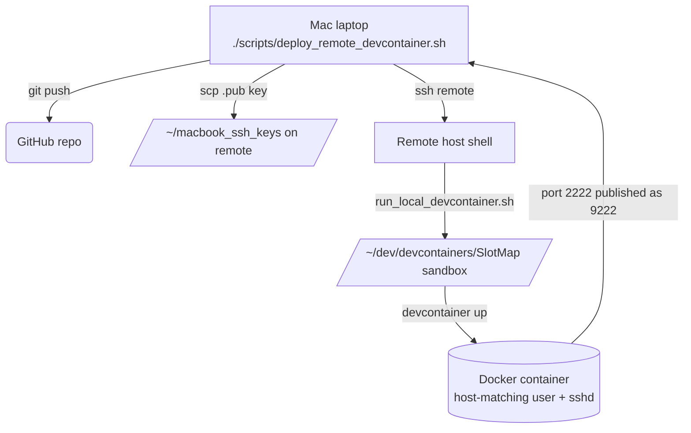

## Remote Devcontainer Workflow

This document describes how the SlotMap devcontainer is deployed on a shared Linux host while source control stays clean. It captures the directory layout, the scripts that orchestrate the flow, troubleshooting tips, and a visual workflow diagram.

### Goals
- Keep `/home/<user>/dev/github/SlotMap` as a clean clone that mirrors Git history.
- Build and run the devcontainer in a sandbox (`~/dev/devcontainers/SlotMap`) that is recreated on every deployment.
- Stage Mac public keys on the remote host (`~/macbook_ssh_keys`) so SSH access to the container can be automated without committing keys to the repo.
- Provide a single local command (`./scripts/deploy_remote_devcontainer.sh`) that pushes code, copies keys, and rebuilds the remote container end-to-end.

### Directory Layout
| Path | Description |
| --- | --- |
| `~/dev/github/SlotMap` | Clean git clone on the remote host. No untracked files; only `git pull` and script execution happen here. |
| `~/macbook_ssh_keys` | Remote cache for `.pub` files copied from laptops. Managed per-user; never committed. |
| `~/dev/devcontainers/SlotMap` | Sandbox used by `run_local_devcontainer.sh`. Recreated from the clean repo and includes `.devcontainer/ssh/*.pub` copied from the cache. |
| `/workspaces/SlotMap` | Path inside the container where the sandbox is mounted. `post_create.sh` copies staged keys into `/home/<dev-user>/.ssh/authorized_keys`. |

### Workflow Diagram

### Required Local Checks Before Deploy
1. Run `./scripts/pre_commit.sh` locally. It stays fast and validates:
   - `scripts/check_docker_bake.sh` – prints and dry-runs `.devcontainer/docker-bake.hcl` to ensure targets/args parse before building.
   - `scripts/check_devcontainer_config.sh` – validates `devcontainer.json`/`*.jsonc` structure (skips if Docker/CLI missing).
   - `hadolint` on `.devcontainer/Dockerfile` (warnings allowed) to catch Dockerfile issues early.
   - `shellcheck --severity=warning scripts/*.sh` to lint helper scripts.
2. Only commit/push after these pass. If any fail, fix locally first.
3. Push and watch GitHub Actions (linters/validators) until they go green. Do not trigger the remote rebuild until CI is clean.
4. After CI is green, run `./scripts/deploy_remote_devcontainer.sh --remote-host c24s1.ch2` (and `--remote-user` if needed) to rebuild the devcontainer on the remote host.

### Detailed Steps
1. **Local machine (Mac)**  
   Run `./scripts/deploy_remote_devcontainer.sh`. The script:
   - Verifies the working tree is clean and pushes the current branch to `origin`.
   - Copies `~/.ssh/id_ed25519.pub` (configurable) to `${REMOTE_USER}@${REMOTE_HOST}:~/macbook_ssh_keys/`.
   - SSHes into the remote host and invokes `scripts/run_local_devcontainer.sh`.

2. **Remote host (`run_local_devcontainer.sh`)**  
   - Removes `~/dev/devcontainers/SlotMap` and re-creates it.  
   - `rsync`s the clean repo into the sandbox.  
   - Copies every `*.pub` from `~/macbook_ssh_keys` into `sandbox/.devcontainer/ssh`.  
   - Calls `devcontainer up --workspace-folder ~/dev/devcontainers/SlotMap --remove-existing-container --build-no-cache`.

3. **Devcontainer lifecycle**  
   - Docker builds `.devcontainer/Dockerfile` (LLVM 21 toolchain, Ninja, mold, MRDocs, IWYU, etc.).  
   - Feature `ghcr.io/devcontainers/features/sshd` starts an SSH server that listens on container port `2222`. `runArgs` map host `9222` to container `2222`.  
   - `.devcontainer/scripts/post_create.sh` fixes permissions, copies staged `.pub` files to `/home/<dev-user>/.ssh/authorized_keys`, and runs `cmake --preset clang-debug`.  
   - The deploy script logs output under `logs/deploy_remote_devcontainer_<timestamp>.log` for later review.

4. **Connecting from the laptop**  
   - After the script reports success, connect with `ssh -i ~/.ssh/id_ed25519 -p 9222 <remote-username>@c24s1.ch2`. The username equals the Linux account on the host because build args set the devcontainer user accordingly.  
   - CLion or VS Code can reuse the same host/port if they prefer direct SSH.

### Troubleshooting & Validation Checklist
| Check | Command |
| --- | --- |
| Confirm container is running and exposing the port | `ssh ${REMOTE_USER}@${REMOTE_HOST} "docker ps --filter label=devcontainer.local_folder=/home/${REMOTE_USER}/dev/devcontainers/SlotMap --format 'table {{.ID}}\t{{.Ports}}\t{{.Names}}'"` |
| Inspect staged keys inside the container | `docker exec -u <remote-username> <container> ls -l /home/<remote-username>/.ssh/authorized_keys` |
| View SSHD logs | `docker exec -u root <container> tail -n 100 /var/log/auth.log` |
| Clean up stuck containers/images | `docker rm -fv $(docker ps -aq --filter label=devcontainer.local_folder=/home/${REMOTE_USER}/dev/devcontainers/SlotMap)` and `docker system prune -af --volumes` |
| Validate toolchain bits (cmake/ninja/IWYU/etc.) | `docker exec -u <remote-username> <container> include-what-you-use --version` |
| Validate GCC from toolchain PPA | `docker exec -u <remote-username> <container> gcc-14 --version` |
| Confirm caching/search helpers | `docker exec -u <remote-username> <container> ccache --version && sccache --version && rg --version` |
| Rebuild sandbox manually on remote | `cd ~/dev/github/SlotMap && ./scripts/run_local_devcontainer.sh` |

If SSH fails with `Connection reset by peer`, verify that `/home/<remote-username>/.ssh/authorized_keys` exists and the runArgs publish `9222:2222`.

### Notes
- The sandbox copy is refreshed on every deployment, so local edits must be committed/pushed before running the helper.
- Multiple developers can share the same remote host: each user copies their `.pub` files into their own `~/macbook_ssh_keys`, and the scripts remain parameterized (`--remote-user`, `--ssh-key`, etc.).
- `logs/` contains timestamped execution transcripts for traceability. Include them in bug reports or when auditing remote builds.

For details on the helper scripts themselves see `scripts/deploy_remote_devcontainer.sh` (local) and `scripts/run_local_devcontainer.sh` (remote). Both scripts print verbose status messages so you can follow the entire workflow from your terminal or CI logs.
