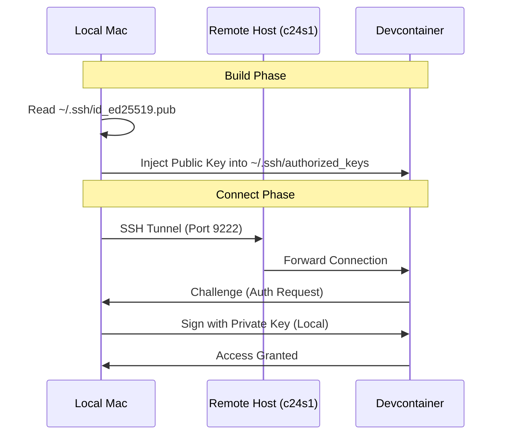
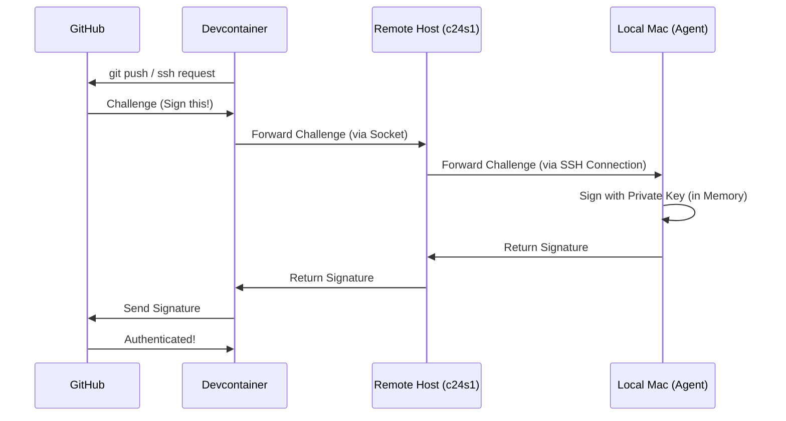
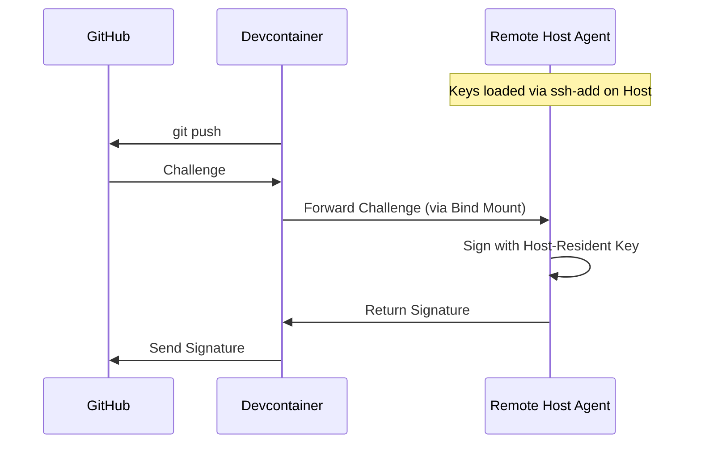

# Devcontainer & Docker Setup Review

## Executive Summary

The current setup for remote devcontainer development is functional but suffers from **critical security risks**, **unnecessary complexity**, and **deviation from standard practices**.

The primary issues are:

1. **Security:** Private SSH keys are being synced to the remote host.
2. **Architecture:** Custom shell scripts (`deploy_remote_devcontainer.sh`, `run_local_devcontainer.sh`) re-implement functionality that is native to the `devcontainer` CLI.
3. **Maintainability:** The use of `docker-bake` for simple image builds adds an extra layer of abstraction that complicates the workflow without clear benefit for this specific use case.

---

## 1. Critical Security Risk: Syncing Private SSH Keys

### Issue

The script `scripts/deploy_remote_devcontainer.sh` synchronizes the **entire** local `~/.ssh` directory to the remote host.

**Code Reference:**

```bash
# scripts/deploy_remote_devcontainer.sh:121
rsync -e "${RSYNC_SSH}" -av --chmod=F600,D700 --rsync-path="mkdir -p ${REMOTE_SSH_SYNC_DIR} && rsync" \
    "${SSH_SYNC_SOURCE}" "${REMOTE_USER}@${REMOTE_HOST}:${REMOTE_SSH_SYNC_DIR}/"
```

By default, `SSH_SYNC_SOURCE` is `$HOME/.ssh/`. This means your private keys (e.g., `id_ed25519`, `id_rsa`) are copied to the remote machine.

### Why this is a bug/risk

* **Identity Theft:** If the remote host is compromised, an attacker gains access to your private keys, allowing them to impersonate you on GitHub, other servers, etc.
* **Shared Host Risk:** On shared remote dev servers, other users with root access (or misconfigured permissions) could potentially access these files.
* **Best Practice Violation:** Private keys should never leave the local machine unless absolutely necessary and done via secure, encrypted channels (like agent forwarding).

### Suggested Fix

**Use SSH Agent Forwarding.**
Instead of copying keys, forward your local SSH agent to the container. This allows the container to use your local keys for authentication without ever storing them on the remote filesystem.

**Documentation:**

* [VS Code Devcontainers: Using SSH Keys](https://code.visualstudio.com/remote/advancedcontainers/sharing-git-credentials#_using-ssh-agent-forwarding)
* [Devcontainer CLI: SSH Agent Forwarding](https://containers.dev/implementors/json_reference/#lifecycle-scripts)

**Implementation Plan:**

1. Modify `deploy_remote_devcontainer.sh` to explicitly exclude private keys or only include `*.pub` files.
2. Ensure `ForwardAgent yes` is set in your local `~/.ssh/config` for the remote host.
3. The `devcontainer` CLI automatically handles forwarding the agent socket into the container.
4. **Update Tests:** The script `scripts/test_devcontainer_ssh.sh` currently hardcodes usage of `~/.ssh/id_ed25519` inside the container. This must be updated to use the SSH agent (remove `-i` flag or use agent socket) to prevent regression failures.

### Visualizing the Secure Workflow

**1. Inbound SSH (Mac -> Container)**
The container uses your *public* key (injected at build time) to authenticate you.



**2. Outbound SSH (Container -> GitHub)**
The container uses *Agent Forwarding* to sign requests using your local Mac's agent. Private keys never leave the Mac.



**3. Remote-Resident SSH Agent (Advanced/Persistent)**
For workflows where the container needs SSH access even when your Mac is disconnected (e.g., long-running background jobs), you can use an SSH agent running on the *Remote Host*.

* **Requirement:** An `ssh-agent` process must be running on the remote host (e.g., via systemd user service or `.bash_profile`).
* **Mechanism:** Bind-mount the remote host's `SSH_AUTH_SOCK` into the container.
* **Citations:**
  * [Docker Bind Mounts](https://docs.docker.com/storage/bind-mounts/) - Mechanism for exposing the socket.
  * [OpenSSH Manual: ssh-agent](https://man.openbsd.org/ssh-agent) - Details on the socket-based authentication protocol.



**Configuration for Remote-Resident Agent:**
To implement this, you must bind-mount the socket. Since the socket path can change, it is best to map a stable symlink or use an environment variable.

```json
// devcontainer.json
"mounts": [
    // Mount the host's agent socket to a known path in the container
    "source=${localEnv:SSH_AUTH_SOCK},target=/tmp/ssh-agent.socket,type=bind"
],
"containerEnv": {
    // Tell the container to use that socket
    "SSH_AUTH_SOCK": "/tmp/ssh-agent.socket"
}
```

*Note: `${localEnv:SSH_AUTH_SOCK}` resolves to the environment variable on the machine running the Docker CLI (the Remote Host).*

---

## 2. Over-Engineering: Custom Orchestration Scripts

### Issue

The project relies on a complex chain of scripts to build and run the container:

1. `deploy_remote_devcontainer.sh` (Local) -> Pushes git, syncs keys, calls remote script.
2. `run_local_devcontainer.sh` (Remote) -> Re-creates sandbox, runs `docker buildx bake`, runs `devcontainer up`.

### Why this is an issue

* **Reinventing the Wheel:** The `devcontainer` CLI is designed to handle remote builds and execution contexts natively.
* **Fragility:** Custom scripts are prone to breaking with environment changes (e.g., path differences, missing dependencies like `npm` or `rsync`).
* **Disconnected Workflow:** The "sandbox" approach creates a copy of the repo on the remote, meaning changes made inside the container are not immediately reflected in your local source (unless you push/pull).

### Suggested Fix

**Use `devcontainer up` with a Remote Docker Context.**
You can run the `devcontainer` CLI locally and point it to the remote Docker engine.

**Documentation:**

* [Docker Contexts](https://docs.docker.com/engine/context/working-with-contexts/)
* [Devcontainer CLI Reference](https://github.com/devcontainers/cli)

**Implementation Plan:**

* [Docker Contexts](https://docs.docker.com/engine/context/working-with-contexts/)
* [Devcontainer CLI Reference](https://github.com/devcontainers/cli)

**Implementation Plan:**

1. Eliminate `run_local_devcontainer.sh`.
2. Run `devcontainer up --docker-host ssh://user@remote` directly from your local machine.
3. Mount the source code using a named volume or let the CLI handle the git clone (using "Clone Repository in Container Volume" pattern).

---

## 3. Complexity: `docker-bake` vs. `devcontainer.json`

### Issue

The project uses `docker-bake.hcl` to define the build targets and dependencies, which are then invoked by the custom scripts.

### Why this is an issue

* **Non-Standard:** While `docker-bake` is powerful, it is less common in the devcontainer ecosystem than a standard `Dockerfile` or `docker-compose.yml`.
* **Duplication:** `devcontainer.json` already has a `build` property. Splitting the logic between `json`, `hcl`, and `sh` makes it harder to understand the source of truth.

### Suggested Fix

**Consolidate into `devcontainer.json` and `Dockerfile`.**
Move the build arguments and logic into `devcontainer.json`. If multiple stages are needed (e.g., for caching), use a multi-stage `Dockerfile`.

**Documentation:**

* [devcontainer.json Reference: build](https://containers.dev/implementors/json_reference/#image-build-properties)

**Implementation Plan:**

1. Update `devcontainer.json` to use `"build": { "dockerfile": "Dockerfile" }`.
2. Pass necessary build args (like `UBUNTU_VERSION`) directly in `devcontainer.json`.
3. Remove `docker-bake.hcl` unless there is a specific requirement for parallel matrix builds that `docker build` cannot handle (which is rare for a single dev environment).

---

## 4. Feature Usage: `sshd` and Tools

### Issue

The current setup manually installs `sshd` and manages keys via `post_create.sh`. It also installs tools like `node`, `gh`, etc., via `Dockerfile` instructions.

### Why this is an issue

* **Maintenance Burden:** You are responsible for updating the installation instructions for every tool.
* **Wheel Reinvention:** The `devcontainers/features` library already provides maintained, best-practice installations for these tools.

### Suggested Fix

**Use Devcontainer Features.**
Replace manual `Dockerfile` RUN instructions with features in `devcontainer.json`.

**Documentation:**

* [Dev Container Features](https://containers.dev/features)
* [sshd Feature](https://github.com/devcontainers/features/tree/main/src/sshd)

**Implementation Plan:**

1. Add `"ghcr.io/devcontainers/features/sshd:1"` to `devcontainer.json`. It handles key setup and config automatically.
2. Add `"ghcr.io/devcontainers/features/node:1"`, `"ghcr.io/devcontainers/features/github-cli:1"`, etc.
3. Remove corresponding sections from the `Dockerfile`.

---

## Summary of Recommendations

| Priority | Action | Benefit |
| :--- | :--- | :--- |
| **High** | **Stop syncing private keys** | Prevents potential identity theft. |
| **Medium** | **Switch to `devcontainer` CLI native remote** | Simplifies workflow, removes custom scripts. |
| **Medium** | **Adopt Devcontainer Features** | Reduces Dockerfile maintenance, ensures best practices. |
| **Low** | **Remove `docker-bake`** | Simplifies build configuration. |
